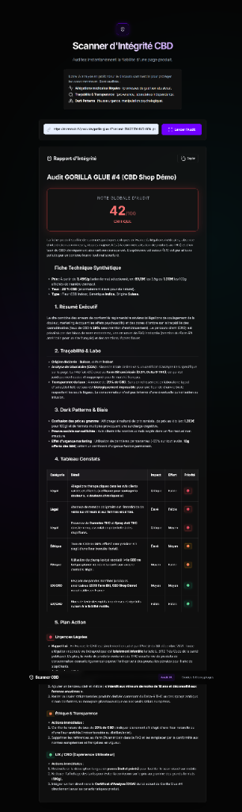

# 🛡️ Scanner d'Intégrité CBD (Agent IA)

Un outil d'audit intelligent conçu pour analyser instantanément les fiches produits des sites e-commerce de CBD. Il évalue la conformité légale, la transparence et l'éthique marketing à l'aide d'un moteur de règles déterministe couplé à l'intelligence artificielle (Google Gemini).



## 🎯 Pourquoi ce projet ?

Le marché du CBD en ligne souffre de nombreuses pratiques limites : fausses allégations médicales (interdites par l'ANSM), usurpation de variétés agricoles, présence de cannabinoïdes synthétiques non déclarés, et *dark patterns* (fausses urgences). 

J'ai conçu ce projet comme un **Micro-SaaS d'audit** pour automatiser la détection de ces pratiques. Il sert de démonstrateur technique de mes compétences en intégration IA, en architecture logicielle et en expertise métier légale/CBD.

> **Pourquoi le projet n'est pas hébergé publiquement ?**
> Les requêtes vers un LLM (Large Language Model) consomment des tokens payants. Une exposition publique sans système d'authentification (paywall) entraînerait des abus rapides. Ce dépôt sert donc de portfolio et de preuve de concept (POC) Open-Source.

---

## ⚙️ Fonctionnalités Principales

*   **Extraction Automatisée (Scraping)** : Le backend Python extrait le contenu sémantique d'une URL produit en ignorant le bruit (scripts, styles) via `BeautifulSoup`.
*   **Moteur de Règles Pré-calculées (Regex)** : Avant d'interroger l'IA, le système vérifie 12 règles strictes (présence du mot "gummies", taux de CBD abérrants > 12%, lexique thérapeutique illégal). Cela limite les hallucinations de l'IA et fournit des preuves factuelles.
*   **Analyse Sémantique (LLM)** : Utilisation de l'API Google Gemini (`gemini-flash-lite-latest`) couplée à un *Prompt Engineering* très strict pour synthétiser un rapport d'audit formaté (Score global, plan d'action priorisé 🔴🟠🟢).
*   **Base de Connaissances Intégrée (SSR)** : Un blog de décryptage du marché rendu côté serveur (Server-Side Rendering via Jinja2) pour une indexation SEO optimale.
*   **Interface Moderne** : Design UI/UX "Digital SaaS" (Dark mode, Glassmorphism, icônes Lucide, animations fluides).

---

## 🏗️ Architecture Technique

*   **Backend** : Python 3, Flask, Jinja2
*   **IA & NLP** : Google GenAI SDK (Gemini)
*   **Scraping** : Requests, BeautifulSoup4
*   **Frontend** : HTML5, Vanilla CSS3 (Custom Properties), JavaScript ES6
*   **Rendu Markdown** : Marked.js

### Structure du projet

```
agentFP/
│
├── app.py                  # Serveur Flask et logique backend (API + Routes)
├── requirements.txt        # Dépendances Python
├── data/
│   └── articles.json       # Base de données des articles du blog
│
├── templates/              # Vues Jinja2 (SSR)
│   ├── layout.html         # Base commune (Navbar, styles)
│   ├── index.html          # Outil de scanner (Page d'accueil)
│   ├── blog_index.html     # Liste des articles (Base de connaissances)
│   └── article_detail.html # Vue détaillée d'un article
│
└── static/                 # Fichiers statiques
    ├── style.css           # Design UI/UX
    └── script.js           # Logique Frontend (appels API, UI state, regex des scores)
```

---

## 🚀 Installation & Utilisation en Local

### Prérequis
*   Python 3.9 ou supérieur
*   Une clé API Google Gemini (gratuite sur Google AI Studio)

### Étapes

1. **Cloner le dépôt**
   ```bash
   git clone https://github.com/votre-nom/scanner-integrite-cbd.git
   cd scanner-integrite-cbd
   ```

2. **Créer un environnement virtuel et installer les dépendances**
   ```bash
   python -m venv venv
   # Sur Windows : venv\Scripts\activate
   # Sur Mac/Linux : source venv/bin/activate
   pip install -r requirements.txt
   ```

3. **Configurer la clé API**
   Vous devez définir votre clé API dans vos variables d'environnement.
   ```bash
   # Sur Windows (PowerShell)
   $env:GEMINI_API_KEY="votre_cle_api_ici"
   
   # Sur Mac/Linux
   export GEMINI_API_KEY="votre_cle_api_ici"
   ```

4. **Lancer le serveur**
   ```bash
   python app.py
   ```
   Le site sera accessible sur `http://127.0.0.1:5000`.

---

## 👨‍💻 À propos de l'auteur

**Thierry Thiesson**  
Développeur Full-Stack / Expert IA, passionné par la transparence du e-commerce et la création d'outils analytiques métier. Ce projet reflète mon approche méthodique (BMAD) : compréhension approfondie du domaine (ici, la législation complexe du chanvre) et exécution technique rigoureuse (architecture, prompt engineering, UX).

* 🌐 **Portfolio** : [https://present-me-lake.vercel.app/](https://present-me-lake.vercel.app/)
* 🐙 **GitHub** : [https://github.com/mist3rth](https://github.com/mist3rth)
* 🚀 **Projet** : [Scanner d'Intégrité CBD (agentFP)](https://github.com/mist3rth/agentFP)
